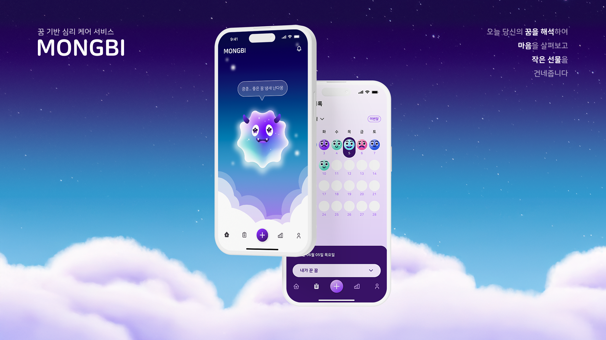
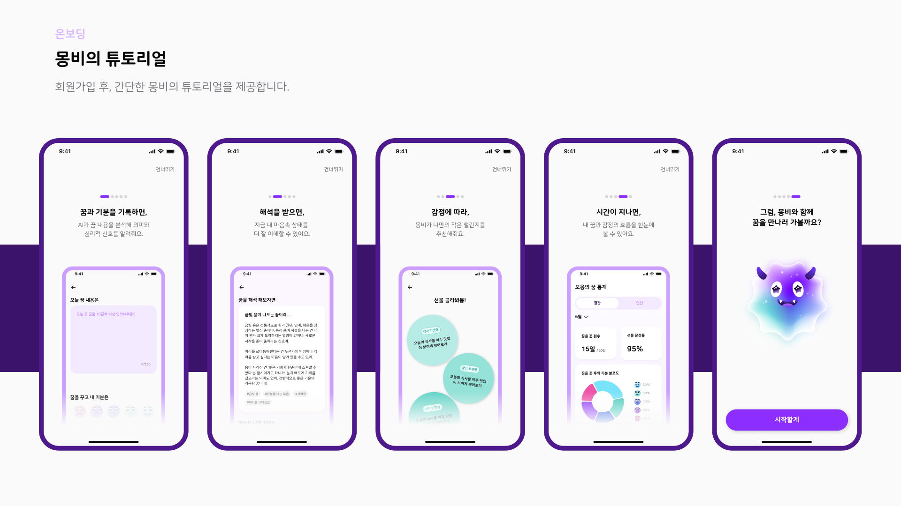
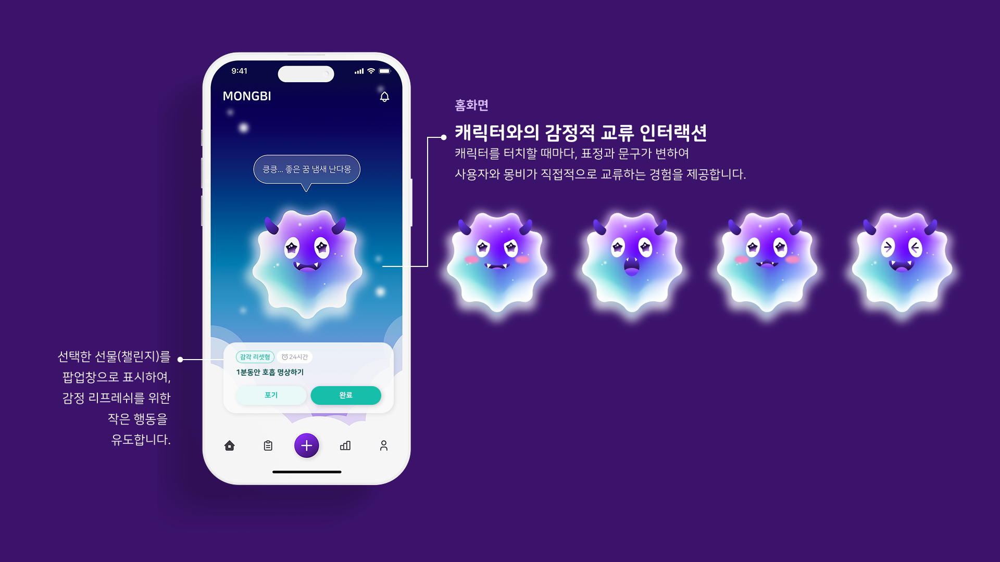
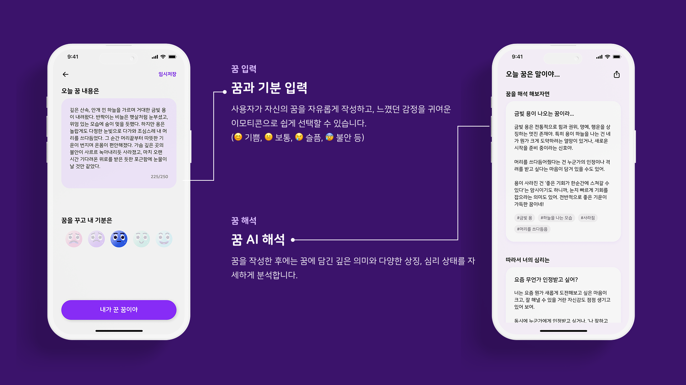
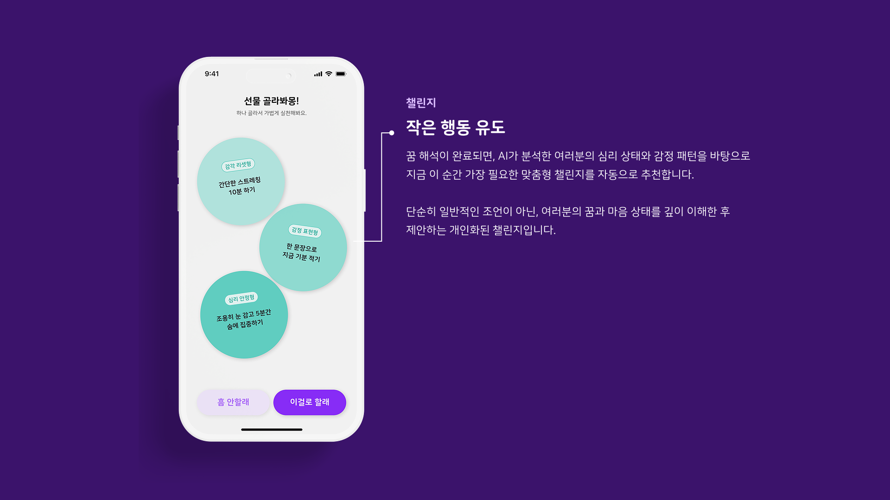
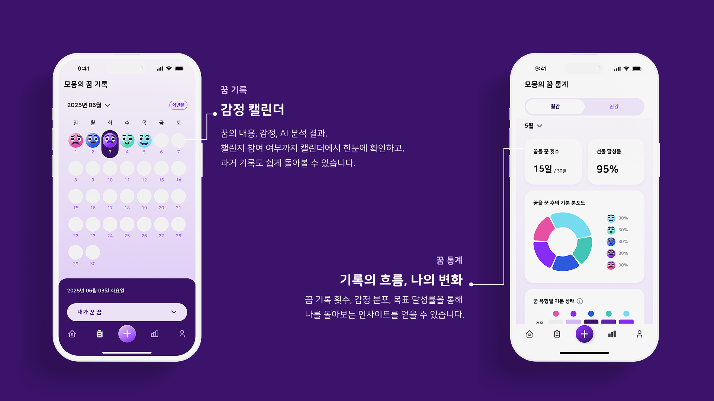

# ✨ 몽비: 꿈을 먹는 도깨비

<h2>현대인의 머릿속은 늘 복잡하죠.</h2>
<h3>몽비와 함께라면, 잠든 사이 떠오른 꿈이 내 감정의 지도가 됩니다.</h3>

- 자주 꿈을 꾸지만, 의미를 몰라 궁금했던 분!
- 감정을 정리하고 싶지만 방법을 모르겠던 분!
- 자기이해와 감정 회복이 필요한 요즘, 나를 위한 시간이 필요한 분!
- 지금 **몽비**와 함께 당신의 무의식을 들여다보고, 마음을 돌보는 하루를 시작해보는 것은 어떨까요?

 

## ✈️ 개요

- **꿈을 작성**하고 꿈에 대한 자신의 현재 **기분을 선택**할 수 있어요.
- **AI가 해몽, 감정과 내면의 심리까지 분석**할 수 있어요.
- 분석 결과에 따라 **감정 해소를 위한 맞춤 챌린지**를 제공해요.
- 캘린더로 꿈과 해석, **감정 변화를 한눈에** 볼 수 있고,
- 꿈 작성 횟수, 챌린지 달성률, 감정·키워드 그래프 등 다양한 통계를 통해 **자신의 내면 패턴과 감정 흐름을 파악**할 수 있어요.

몽비를 통해 사용자는 자신의 꿈을 깊이 있게 돌아보고, 감정 관리와 자기 이해, 그리고 꾸준한 정서적 성장을 경험할 수 있어요.

 

## 📚 주요 기능

 

## 👥 Team - (주)코드시인협회

<a href="https://github.com/Meezzi/mongbi-app/wiki">WIKI - 스크럼, 기능명세서</a>

<table align="center">
  <tr>
    <td align="center" width="180px"><b>강민지 (팀장)</b></td>
    <td align="center" width="180px"><b>최문경 (팀원)</b></td>
    <td align="center" width="180px"><b>문준호 (팀원)</b></td>
    <td align="center" width="180px"><b>이현진 (팀원)</b></td>
  </tr>
  <tr>
    <td align="center">
      <a href="https://github.com/Meezzi">Meezzi</a>
    </td>
    <td align="center">
      <a href="https://github.com/mooni369">mooni369</a>
    </td>
    <td align="center">
      <a href="https://github.com/monho">monho</a>
    </td>
    <td align="center">
      <a href="https://github.com/hyunjin912">hyunjin912</a>
    </td>
  </tr>
  <tr>
    <td align="center">
      
    </td>
    <td align="center">
      
    </td>
    <td align="center">
      
    </td>
    <td align="center">
      
    </td>
  </tr>
  <tr>
    <td align="center"><b>전체 총괄 및 개발</b></td>
    <td align="center"><b>디자인</b></td>
    <td align="center"><b>개발</b></td>
    <td align="center"><b>개발</b></td>
  </tr>
</table>

- 강민지 - 홈 화면, 꿈 작성 , 꿈 해석, 챌린지 선택
  마이페이지 UI, 배경음악 삽입, 로그인 시 에러 처리
  깃허브 컨벤션 설정, 앱 전반적인 코어 개발 담당
- 최문경 - 와이어 프레임 , 일러스트 , 앱 디자인 및 캐릭터 디자인 그 외 디자인 적 요소 및 기획적인 부분등  전반적 개발 외적 분야 담당
- 문준호 - REST API 설계, DB설계 
  API 구축 , 관리자 페이지개발 
  로그인 , 닉네임설정, 온보딩 등 전반적인 앱 초기 기능 담당 및 백앤드 서버 개발 담당
- 이현진 - 꿈 통계 , 꿈 기록, 캘린더 , 그래프 개발 등 전반적인 앱 사용 기록 및 데이터 시각화 담당

 

## 🛠️ 기술 스택

| 구분             | 사용 기술                           |
| ---------------- | ----------------------------------- |
| Architecture     | `Clean Architecture`                |
| Design Pattern   | `MVVM`                              |
| State Management | `Riverpod`                          |
| Network          | `REST API`                          |
| Local DB         | `SharedPreferences` `SecureStorage` |
| Firebase         | `Messaging` `Analytics`             |
| Async Task       | `Future`                            |
| Monitoring       | `Sentry`                            |
| UI               | `Figma` `Flutter` `GoRouter`        |

 

## ⚙️ 기술적 의사결정

아키텍처 패턴의 경우 왜 <b>Clean Architecture</b>를 사용했나요?

### 1. 문제 정의

꿈 해석 애플리케이션 개발에 적합한 아키텍처 패턴 선택이 필요합니다.  
복잡한 AI 기반 비즈니스 로직, 외부 API 의존성, 그리고 지속적인 기능 확장 요구사항을 고려한 아키텍처 설계가 필요한 상황입니다.

---

### 2. 기술적 요구사항

- **외부 의존성:** Claude API 등 AI 서비스 통합
- **개발 방법론:** TDD (Test-Driven Development) 적용
- **확장성:** 새로운 AI 모델 및 심리 분석 기법 추가 예정
- **안정성:** 네트워크 불안정성 및 API 비용 고려 필요

---

### 3. 대안 분석

#### 1) Layered Architecture

- **장점:** 레이어별 관심사 분리
- **단점:** 순환 의존성 위험, 하위 레이어 변경 시 상위 레이어에 영향

#### 2) Clean Architecture - 선정

- **장점:** 의존성 역전, 테스트 용이성, 확장성
- **단점:** 초기 구현 복잡도

---

### 4. 선택 이유

#### 1) TDD 개발 방법론 적용

**문제점**: 꿈 해석 로직과 챌린지 추천 알고리즘은 복잡한 비즈니스 규칙을 포함하고 있어 철저한 테스트가 필요합니다. TDD를 적용하여 안정적인 개발을 진행하기 위해서는 **테스트 가능한 구조가 필수**입니다.

**해결책**: **Clean Architecture**의 레이어 분리를 통해 각 계층별로 독립적인 단위 테스트가 가능하며, 특히 Domain 레이어의 Use Case들을 **외부 의존성 없이 순수하게 테스트**할 수 있어 **TDD** 사이클을 효과적으로 적용할 수 있습니다.

#### 2) AI API 의존성 관리

**문제점**: Claude API와 같은 외부 AI 서비스는 응답 시간이 길고 비용이 발생하며, 네트워크 상태에 따라 불안정할 수 있습니다.

**해결책**: **Repository Pattern**을 통해 AI API 호출을 추상화하고, Domain 레이어에서는 인터페이스만 의존하도록 설계했습니다. 이를 통해 테스트 시에는 **Mock 객체를 사용**하고, 실제 운영에서는 실제 API를 호출하는 방식으로 유연하게 대응할 수 있습니다.

네비게이션의 경우 왜 <b>Navigator</b> 대신 <b>GoRouter</b>를 사용했나요?

### 1. 문제 정의

꿈 해석 애플리케이션에서 복잡한 중첩 네비게이션 구조와 탭 기반 독립적 네비게이션 스택 관리가 필요한 상황으로  
Flutter 기본 Navigator로는 다음과 같은 한계점이 존재합니다.

---

### 2. 기술적 요구사항

- **중첩 네비게이션:** 탭 내부의 여러 단계 페이지 이동
- **상태 보존:** 탭 전환 시 네비게이션 스택 유지
- **등록 라우팅:** 꿈 ID, 챌린지 ID 등 파라미터 기반 페이지 이동
- **딥링킹:** URL을 통한 특정 페이지 직접 접근

---

### 3. 대안 분석

#### 1) Flutter 기본 Navigator

- **장점:** 내장 솔루션, 간단한 사용법, 경량성
- **단점:** 중첩 네비게이션 복잡성, 명령형 접근, 보일러플레이트, 딥링킹 한계

#### 2) GoRouter (Google 공식) - 선정

- **장점:** 선언적 라우팅, 중첩 네비게이션, URL 기반, 타입 안전성
- **단점:** 학습 곡선, 안정성 이슈

---

### 4. 선택 이유

#### 1) 복잡한 중첩 네비게이션 구조 관리

- **문제점:** 꿈 해석 앱의 메인 탭(홈, 기록, 통계, 설정) 내에 각기 여러 단계의 중첩 페이지가 존재합니다.  
  특히 '꿈 작성 → 해석 중 → 결과 확인 → 챌린지 추천' 같은 복잡한 플로우와 탭별 독립적인 네비게이션 스택이 필요했습니다.

- **해결책:** Navigator.push로는 각 탭의 네비게이션 스택을 독립적으로 관리하기 어렵지만,  
  GoRouter의 ShellRoute를 사용하면 탭별로 독립된 네비게이션 스택을 관리하고 MainScaffold를 통해 공통 레이아웃을 유지하면서 상태 보존이 가능합니다.

#### 2) 선언적 라우팅을 통한 코드 품질 향상

- **문제점:** 명령형 네비게이션(Navigator.push)은 라우팅 로직이 여러 곳에 분산되어 유지보수가 어렵고,  
  매번 MaterialPageRoute를 생성해야 하는 번거로움이 있습니다.

- **해결책:** GoRouter의 선언적 라우팅을 통해 모든 라우팅을 한 곳에서 정의하고,  
  `context.push('/dream/:id')`와 같이 URL 기반으로 명확하게 표현하여 코드 가독성과 유지보수성을 크게 향상시켰습니다.

로컬 스토리지의 경우 왜 <b>SharedPreferences</b>와 <b>Flutter Secure Storage</b>를 분리해서 사용했나요?

### 1. 문제 정의

꿈 해석 애플리케이션에서 서로 다른 보안 수준과 접근 패턴을 가진 데이터를 효율적으로 저장해야 하는 상황입니다.

---

### 2. 기술적 요구사항

- **메모리 효율성:** 앱 실행 중 설정값 캐싱
- **동기화:** 설정 변경 시 즉시 UI 반영
- **민감 정보 암호화:** AES 256 수준의 강력한 암호화

---

### 3. 대안 분석

#### 1) SharedPreferences만 사용

- **장점:** 빠른 성능으로 모든 데이터 접근 가능, 단순한 구현, 메모리 캐싱
- **단점:** 보안 취약점 존재, 민감 정보 노출 위험 높음, 디바이스 루팅 시 데이터 유출 가능

#### 2) Flutter Secure Storage만 사용

- **장점:** 모든 데이터가 암호화, OS 레벨 보안 기능 활용, 일관된 저장 방식으로 관리 단순화
- **단점:** 설정값 접근 시마다 암호화/복호화 성능 저하, 잦은 설정 변경 시 배터리 소모 증가, 불필요한 보안 비용 발생

---

### 4. 선택 이유

#### 1) 보안 수준에 따른 데이터 분리 필요

- **문제점:** 꿈 해석 앱의 API 인증을 위한 Access Token, Refresh Token과 같은 민감 정보와 BGM 설정, 알림 설정 등의 일반적인 사용자 설정값을 모두 저장해야 합니다. 민감한 정보가 유출될 경우 사용자 계정 탈취나 개인정보 침해가 발생할 수 있습니다.

- **해결책:**
  - **Flutter Secure Storage**는 iOS Keychain과 Android EncryptedSharedPreferences를 활용하여 AES 암호화로 민감한 인증 정보를 안전하게 보관하고,
  - **SharedPreferences**는 일반 설정값을 빠르게 접근할 수 있도록 분리하여 보안성과 성능을 모두 확보했습니다.

#### 2) 접근 빈도와 성능 최적화

- **문제점:** 사용자 설정값(BGM, 알림 등)은 앱 실행 중 자주 변경되고 즉시 반영되어야 하지만, 인증 토큰은 한 번 저장 후 API 요청 시에만 필요합니다. Secure Storage는 암호화/복호화 과정으로 인해 상대적으로 접근 속도가 느릴 수 있습니다.

- **해결책:**
  - **SharedPreferences**는 메모리 기반 캐싱으로 빠른 읽기/쓰기 성능을 제공하여 자주 변경되는 설정값에 사용하고,
  - **Flutter Secure Storage**는 보안이 중요한 인증 정보처럼 접근 빈도가 낮은 인증 정보에만 사용하여 성능과 보안의 균형을 맞췄습니다.

모니터링 및 분석의 경우 왜 <b>Firebase Analytics</b>와 <b>Sentry</b>를 함께 사용했나요?

### 1. 문제 정의

꿈 해석 애플리케이션에서 사용자 행동 분석과 기술적 안정성 모니터링을 모두 효과적으로 수행해야 하는 상황입니다.

---

### 2. 기술적 요구사항

- **커스텀 이벤트:** 비즈니스 핵심 액션 추적
- **자동 화면 추적:** 모든 페이지 전환 자동 로깅
- **퍼널 분석:** 단계별 이탈률 측정
- **실시간 에러 알림:** 크리티컬 이슈 즉시 통지

---

### 3. 대안 분석

#### 1) Firebase Analytics만 사용

- **장점:** Google 생태계 완전 통합, 무료 플랜, BigQuery 연동, 사용자 행동 분석에 특화된 기능
- **단점:** 에러 추적 기능의 한계, 실시간 알림 시스템 미흡, 기술적 문제 디버깅에 필요한 정보 부족, 성능 모니터링 기능 제한

#### 2) Sentry만 사용

- **장점:** 강력한 에러 추적 및 성능 모니터링, 실시간 알림 및 이슈 관리 시스템, 릴리즈 추적 및 회귀 분석
- **단점:** 사용자 행동 분석 기능 전혀 없음, 마케팅 및 프로덕트 분석 도구 부재

#### 3) Firebase Analytics + Sentry - 선정

- **장점:** 사용자 행동과 기술적 안정성 모두 커버, 상호 보완적인 데이터 수집, 팀별 특화된 도구 활용 가능
- **단점:** 두 가지 도구 관리로 복잡도 증가, 데이터 통합 분석 시 추가 작업 필요, 초기 설정 및 유지보수 비용 증가

---

### 4. 선택 이유

#### 1) 사용자 행동 데이터와 기술적 안정성의 이중 모니터링 필요

- **문제점:** 꿈 해석 앱의 성공을 위해서는 사용자가 어떤 기능을 선호하는지, 어디서 이탈하는지 파악하는 것과 동시에 앱 크래시나 API 에러로 인한 사용자 이탈을 방지해야 합니다. 단일 도구로는 사용자 행동 분석과 기술적 에러를 모두 모니터링하기 어렵습니다.

- **해결책:**
  - **Firebase Analytics**: 사용자 여정, 챌린지 참여율, 로그인 성공률 등 비즈니스 지표를 추적
  - **Sentry**: Claude API 호출 실패, 네트워크 에러, 앱 크래시 등 기술적 문제를 실시간으로 모니터링하여 사용자 경험과 안정성을 동시에 보장

#### 2) GoRouter 통합을 통한 자동화된 사용자 여정 추적

- **문제점:** 꿈 작성부터 분석, 챌린지 추천까지 복잡한 사용자 플로우에서 각 단계별 이탈률과 완료율을 정확히 측정해야 하지만, 수동으로 모든 화면 전환을 추적하면 누락이 발생할 수 있습니다.

- **해결책:**
  - **GoRouter의 FirebaseAnalyticsObserver**를 통해 모든 화면 전환을 자동으로 추적하고, 추가로 로그인 성공, 챌린지 완료, 알림 설정 등 핵심 액션에 대한 커스텀 이벤트를 로깅하여 사용자의 앱 사용 패턴을 체계적으로 분석할 수 있습니다.

왜 Firebase Cloud Firestore가 아닌 REST API 통신을 채택했나요?

### 1. 문제 정의

꿈 해석 애플리케이션에서 클라이언트-서버 간 데이터 통신 방식과 백엔드 아키텍처를 결정해야 하는 상황입니다.

---

### 2. 기술적 요구사항

- **복잡한 관계 쿼리:** JOIN을 통한 다중 테이블 연관 조회
- **API 문서화:** Swagger/OpenAPI를 통한 명세 관리
- **에러 핸들링:** RESTful 상태 코드 및 예측 응답 설계
- **테스트 환경:** Mock 서버 및 통합 테스트 지원

---

### 3. 대안 분석

#### 1) Firestore + Cloud Functions

- **장점:** 서버리스 백엔드로 비즈니스 로직 분리 가능, Firebase 생태계 활용 유지, 자동 스케일링 및 비용 최적화
- **단점:** Cold Start 지연으로 첫 요청 성능 저하, 복잡한 관계형 데이터 처리·디버깅·모니터링 복잡

#### 2) Supabase (PostgreSQL 기반 BaaS)

- **장점:** Firebase 대체 기능, 실시간 기능+인증 포함, PostgreSQL 기반으로 관계형 구조 지원, 빠른 프로토타이핑에 유리
- **단점:** 서버 로직 커스터마이징 한계, 쿼리 튜닝 난이도, 일부 기능 베타 수준, 규모 커질수록 비용 고려 필요

#### 3) NestJS + TypeORM(또는 Prisma) + PostgreSQL

- **장점:** 정형화된 아키텍처로 유지보수 쉬움, 모듈 기반 구조로 대규모 협업에 적합, TypeScript 기반 안정성 확보, GraphQL 등 다양한 연동 가능
- **단점:** 러닝커브 있음, 초기 셋업 복잡, 소규모 프로젝트엔 과도한 구조일 수 있음

#### 4) Express.js + Sequelize + MariaDB (**우리가 선택한 구조**)

- **장점:** RESTful API 설계에 최적화, Sequelize ORM을 통한 관계형 모델링 용이, SQL 기반으로 복잡한 조인·통계·쿼리 구현, Swagger/OpenAPI로 문서화, 에러 코드 및 테스트 구성 자유도 높음
- **단점:** 서버/DB 배포와 관리 직접 해야 함, 인증/보안 관련 추가 구현 필요, 개발 초기 설정 시간 다소 소요

---

### 4. 선택 이유

#### 1) 실무와 유사한 환경에서의 백엔드 경험 추구

- **문제점:** 다른 팀들이 Firebase 기반의 NoSQL을 채택하는 가운데, 우리는 직접 백엔드 서버를 구축하고, 클라이언트와 REST API로 통신하는 구조를 선택했습니다. 이는 단순히 데이터를 주고받는 것을 넘어, 실무에서 자주 마주치는 서버 구축, 인증 처리, RESTful 설계, 에러 응답 설계, API 문서화(Swagger) 등을 경험하고자 했기 때문입니다.

- **해결책:** 이러한 구조는 실제 기업 환경에서 프론트엔드와 백엔드가 역할을 분리하여 협업하는 방식과 유사하며, 개발자 간 명확한 계약(Contract)을 통해 소통하는 연습이 되었습니다. 특히 API 명세 기반의 작업을 통해, 클라이언트가 어떤 데이터를 요청하고, 서버가 어떤 응답을 보내는지를 사전에 정리해 협업했습니다. 이러한 역할 분담과 사전 약속된 방식의 구조화는 팀원 간의 소통을 훨씬 원활하게 만들어주었고, 실제 현업에서 협업할 때 중요한 경험이라고 판단했습니다.

#### 2) 관계형 데이터 구조에 최적화된 서비스 구조

- **문제점:** 꿈 해석 앱은 단순히 데이터를 저장하는 것을 넘어서, 꿈 내용, 감정 카테고리, 키워드, 챌린지 진행 상태 등 복수의 엔티티 간 관계를 기반으로 동작합니다. 이처럼 데이터의 간 관계가 명확할 경우, Firebase Firestore와 같은 NoSQL보다 관계형 데이터베이스(MariaDB)가 훨씬 효과적입니다.

- **해결책:** 예를 들어 사용자의 꿈이 여러 키워드를 포함하고, 각 키워드가 특정 감정군에 매핑되는 구조를 Firestore로 구성하면 데이터 중복과 구조 복잡성이 급격히 증가합니다. 반면 MariaDB에서는 외래키(Foreign Key)를 통해 꿈-감정-키워드-챌린지 간 관계를 정확하고 효율적으로 설계할 수 있어, 유지보수와 확장성 모두에 유리합니다.  
  또한 통계 처리에서는 SQL을 활용한 그룹 집계, 조인, 날짜 필터링 등 강력한 쿼리 기능 덕분에, 꿈 접수 분포나 카테고리별 분석, 챌린지 성공률 등의 데이터를 빠르고 정확하게 가공할 수 있었습니다.

 

## 🚧 트러블 슈팅

> 강민지

mocktail의 any() 사용 시 Bad state 예외 발생

#### 문제 상황

- Repository 테스트 코드에서 any()를 사용하려다 Bad state 예외가 발생함.

#### 원인 분석

- DreamDto가 사용자 정의 타입이라 mocktail이 자동으로 더미 인스턴스를 만들 수 없었고, registerFallbackValue()로 등록하지 않았기 때문.

#### 해결 방법

- FakeDreamDto 클래스를 만들고 setUpAll()에서 fallback 값으로 등록하여 해결.

#### 인사이트/교훈

- mocktail의 타입 처리 방식과 테스트 환경 구성의 중요성을 다시금 깨달음.

---

로그인 과정에서 다양한 예외를 CustomException으로 통합 처리

#### 문제 상황

- 로그인 과정에서 네트워크 오류, 인증 실패, 탈퇴 회원 등 다양한 예외가 각각 개별적으로 처리되거나, 단순히 메시지만 출력되어 원인 파악과 사용자 안내가 어려웠음.

#### 원인 분석

- 모든 예외 상황을 하나의 흐름에서 처리하지 않고, 각기 다른 위치에서 메시지만 출력하거나 처리 방식이 일관되지 않아 사용자 경험이 저하되고, 유지보수도 어려웠음.

#### 해결 방법

- `AuthCancelledException`, `AuthFailedException`, `WithdrawnUserException` 등 상황별 커스텀 예외 클래스를 정의함.
- 로그인 처리 로직에서 상황에 따라 명확한 예외를 throw하도록 수정.
- 뷰(View)에서는 예외 타입에 따라 스낵바로 사용자에게 적절한 피드백을 일관된 방식으로 전달하도록 개선함.

#### 인사이트/교훈

- 예외를 명확하게 분리하고 통합적으로 관리함으로써 사용자 경험이 향상되고, 코드 유지보수가 쉬워졌음.
- 예외 처리의 일관성이 중요하며, 사용자에게 더 정확하고 친절한 안내가 가능해졌음.

---

앱이 백그라운드로 전환된 후에도 배경음악이 계속 재생되는 현상

#### 문제 상황

- 앱이 포그라운드를 벗어나도 배경음악이 계속 재생되어, 사용자가 홈버튼을 누르거나 다른 앱으로 전환해도 음악이 멈추지 않아 혼란을 줌.

#### 원인 분석

- 앱 라이프사이클 변화(포그라운드 ↔ 백그라운드) 시 배경음악 상태를 확인하고 제어하는 코드가 누락되어 있었음.

#### 해결 방법

- `WidgetsBindingObserver`를 구현하여 앱 상태 변화(AppLifecycleState)를 감지하도록 추가.
- `AppLifecycleState.resumed` 상태일 때 `isBgmOn` 값을 확인해 `bgm.resumeBgm()`을 호출하고, 앱이 백그라운드로 전환될 때는 음악을 일시 정지하도록 처리.

#### 인사이트/교훈

- 앱의 라이프사이클을 적절히 관리하는 것이 사용자 경험에 매우 중요함을 다시 한번 인식함.
- UX를 고려한 세밀한 상태 관리가 앱의 완성도를 높인다는 점을 경험함.

 

> 문준호

소셜 로그인(Google, Kakao, Naver, Apple) 연동 및 예외 처리 이슈

#### 문제 상황

- Flutter 클린 아키텍처 구조에서 Google, Kakao, Naver, Apple 소셜 로그인 연동 과정 중 각 플랫폼별 인증 방식 차이와 예외 처리 문제에 직면함.
- Apple 로그인은 UUID 변화, 최초 로그인 정보 제공 제한, 검증 방식 등으로 인해 복잡한 예외 대응이 필요했음.
- Kakao/Naver 로그인은 SDK 설정 오류, 토큰 검증 타이밍 문제 등으로 디버깅과 구조 개선이 요구됨.

#### 원인 분석

- 각 소셜 플랫폼마다 인증 프로세스와 반환 데이터, 예외 발생 시점이 상이하여 일관된 처리 구조가 부재함.
- 클린 아키텍처 도입으로 파일 분산, 상태 관리, DTO↔Entity 변환 등 설계적 고민이 필요했으며, 인증 로직이 여러 계층에 흩어질 위험이 있었음.

#### 해결 방법

- 각 소셜 로그인 플랫폼별 인증 로직을 도메인 계층과 데이터 계층으로 명확히 분리.
- DTO↔Entity 변환을 통해 플랫폼별 데이터 구조 차이를 일관성 있게 처리.
- 인증 실패, 정보 미제공, 토큰 만료 등 다양한 예외 상황에 대해 공통 Exception 핸들러를 설계하여 예외를 일관적으로 관리.
- 구조적으로 상태 관리와 인증 흐름을 분리하여 유지보수성과 확장성을 높임.

#### 인사이트/교훈

- 단순한 기능 구현을 넘어, 직접 설계한 구조를 통해 소셜 로그인 인증의 복잡성을 체계적으로 이해할 수 있었음.
- 클린 아키텍처의 계층적 분리와 일관된 예외 처리가 복잡한 인증 시스템의 견고함과 유지보수성을 크게 향상시킴을 경험함.

 

> 이현진

Expansion Tile 펼침 시 자동 스크롤 기능에서 스크롤 튕김 현상 발생

#### 문제 상황

- Expansion Tile이 펼쳐질 때 자동 스크롤 기능을 추가했으나, 스크롤이 튕기는 현상이 발생함.

#### 원인 분석

- `setState` 호출로 인해 부모 위젯이 재빌드되면서 `GlobalKey`가 소실됨.
- `StatelessWidget`은 매 빌드마다 멤버 변수가 초기화되지만, `StatefulWidget`은 상태 클래스 내부 변수는 유지됨.

#### 해결 방법

- `HistoryNotice` 위젯을 `StatefulWidget`으로 변경하고, `GlobalKey`를 상태 클래스 내부에 선언하여 상태를 유지하도록 수정함.

#### 인사이트/교훈

- 위젯의 생명주기와 빌드 구조에 대한 이해를 깊게 다질 수 있었음.

---

통계 페이지에서 페이지 이동 시 Unhandled Exception: Bad state: Future already completed 발생

#### 문제 상황

- 통계 페이지에서 월간/연간 탭바를 터치한 직후 다른 페이지로 이동하면  
  `Unhandled Exception: Bad state: Future already completed` 에러가 발생함.
- 앱이 멈추거나 치명적인 문제는 아니지만, 서비스 완성도를 위해 해결이 필요했음.

#### 원인 분석

- Riverpod의 `AutoDisposeNotifier`는 페이지가 이동될 때 자동으로 dispose된다.
- dispose 시점에도 비동기 작업이 남아있어 state를 업데이트하려다 이미 dispose된 상태에서 에러가 발생함.

#### 해결 방법

- build 메서드는 오직 초기 state 반환만 담당하도록 역할을 분리.
- 탭 전환, 월/연도 선택 등 사용자 인터렉션에 의한 state 업데이트는 별도 메서드에서 처리.
- `_isMounted` 플래그와 `ref.onDispose` 콜백을 활용해 dispose 시점 이후에는 state 업데이트가 일어나지 않도록 방지.

#### 인사이트/교훈

- Riverpod 뷰모델에도 명확한 생명주기가 존재하며,  
  `AutoDisposeNotifier`의 dispose 타이밍과 비동기 작업의 충돌이 실제로 문제를 일으킬 수 있음을 직접 경험함.
- 상태 업데이트와 위젯 라이프사이클을 항상 염두에 두고 코드를 작성해야 함을 다시 한 번 깨달음.

---

isActive가 true일 때만 표시되는 스크롤 위젯에서 스크롤 위치 감지 에러 발생

#### 문제 상황

- `bool` 타입의 `isActive` 변수가 `true`일 때만 표시되는 스크롤 가능한 위젯에서, 스크롤 위치를 감지하지 못해 에러가 발생함.

#### 원인 분석

- 스크롤 가능한 위젯과 `RawScrollbar` 위젯이 서로 다른 `ScrollController`를 사용하여, 스크롤 위치 동기화가 되지 않아 위치 감지에 실패함.

#### 해결 방법

- 스크롤 가능한 위젯과 `RawScrollbar` 위젯에 동일한 `ScrollController`를 적용하여, 스크롤 위치가 정상적으로 감지되고 동작하도록 수정함.

#### 인사이트/교훈

- 여러 위젯이 동일한 스크롤 상태를 공유해야 할 때는 반드시 같은 `ScrollController`를 사용해야 함을 확인함.

 

## 🎯 앞으로의 목표

몽비는 단기적인 개발을 넘어, 지속적으로 성장하는 프로젝트를 지향합니다.  
아래 3가지 목표를 차근차근 달성하며 몽비의 정체성을 더욱 확립해 나가겠습니다.

### 1. 비즈니스 전략 세우기

- 단순 광고 및 인앱 결제를 넘어, 사용자 행동 데이터를 기반으로 한 타겟팅 전략을 도입합니다.
- 자연스러운 UX 흐름 속에서 수익 구조를 개선하고, 수익 극대화를 위한 전략을 모색할 예정입니다.

### 2. 안드로이드 배포하기

- iOS 배포 경험을 바탕으로 안드로이드 대응을 준비합니다.
- 크로스플랫폼에서 발생할 수 있는 이슈와 정책 차이를 사전에 정리해, 원활한 배포를 목표로 합니다.

### 3. 사용자 경험 개선하기

- 실제 사용자 피드백과 행동 로그를 바탕으로 UX를 지속적으로 개선합니다.
- 진입 장벽을 낮추고, 핵심 기능의 동선을 단순화하는 데 집중하며,  
  마이크로 인터랙션과 접근성까지 고려할 계획입니다.

 
 
 

# 몽비와 함께 꿈을 기록하며,  내 마음을 더 가까이 들여다보세요.
